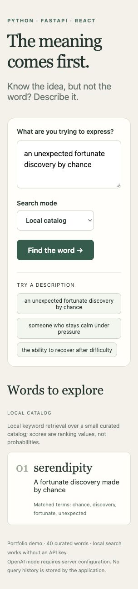

# Reverse Dictionary AI

Describe a meaning and find candidate words. A Python/FastAPI API searches a small SQLite-backed vocabulary, and a React interface displays definitions and matched terms. Optional OpenAI mode reranks retrieved candidates, with strict validation that the model only references existing catalog IDs.

Created with Codex assistance in October 2026. The older reverse-dictionary source mentioned in Favour Ojo's resumes could not be located during the audit. This repository is a new implementation of that idea, not evidence of when the earlier project was built.



## Implementation

- Local description-to-word retrieval over 40 original curated entries, with repeatable ranking and matched-term explanations.
- SQLite catalog, FastAPI input validation, and API documentation.
- React loading, empty-result, and error states.
- Optional OpenAI reranking with timeouts, provider-error handling, and rejection of invalid, duplicate, or new IDs.
- Tests exercise real HTTP and SQLite; model-provider tests mock responses and cost nothing.

Local mode uses keyword overlap and inverse document frequency. It is **not embedding-based semantic search**. It can miss synonyms absent from the small catalog. OpenAI mode reranks retrieved words; it cannot recover words excluded by local retrieval. Scores remain lexical ranking values, not probabilities or AI confidence.

## Run the app

Requires Python 3.12 and Node 22.12+ or 24+.

```sh
python -m venv .venv
# macOS/Linux; on Windows use .venv\Scripts\activate
. .venv/bin/activate
pip install -r requirements-dev.txt
cd frontend
npm ci
npm run build
cd ..
uvicorn backend.main:create_app --factory --host 127.0.0.1 --port 8081
```

Open http://127.0.0.1:8081. The API serves the built UI; API documentation is at `/docs` and health at `/api/health`. For frontend development, run `npm run dev` in `frontend` while the API runs on 8081.

Try “an unexpected fortunate discovery by chance” or “the ability to recover after difficulty.” Unknown terms return an empty result rather than invented definitions.

## OpenAI configuration and verification

Set `OPENAI_API_KEY` in the **server environment**, then restart the API. `.env.example` documents names and is not loaded automatically. Never put credentials in React code or commit them. `OPENAI_MODEL` optionally selects a compatible model; the default is `gpt-4o-mini`.

OpenAI mode sends the description and retrieved definitions to OpenAI and may incur charges. Missing configuration returns 503; provider failures return 502. It never silently disguises local fallback as an OpenAI result.

**Live OpenAI execution was not verified in this audit.** Parsing, timeouts, and provider failures were tested with mocked HTTP. Local retrieval works without a key.

## Verification

```sh
python -m pytest backend/tests -q
cd frontend
npm test
npm run build
```

20 backend tests and 3 UI tests passed during creation, along with the UI build. Tests cover query limits, duplicate catalog initialization, deterministic results, missing keys, malformed model output, invalid IDs, quota errors, and timeouts. GitHub Actions runs these checks. See `docs/VERIFICATION.md` for the final recorded scope.

```sh
curl -X POST http://127.0.0.1:8081/api/search \
  -H 'Content-Type: application/json' \
  -d '{"description":"fortunate discovery by chance","limit":5,"mode":"local"}'
```

Responses identify the mode and include suggestions with word, definition, score, and matched terms. Limits are 1–5 and descriptions 3–300 characters; unknown request fields are rejected. Query history is not stored by the application.

## AI assistance and interview review

Codex generated and verified the initial implementation at the owner's request. Review the code, trace a request, and make a meaningful change before presenting it as work you can explain. Do not claim sole manual authorship or historical course credit.

Explain the separation between retrieval and reranking, the scoring limitations, validation of candidate IDs, and which tests mock the provider. Useful next exercises are a larger vocabulary and an evaluation set of descriptions not copied from definitions. Embeddings and live-model quality remain future work, not completed claims.
