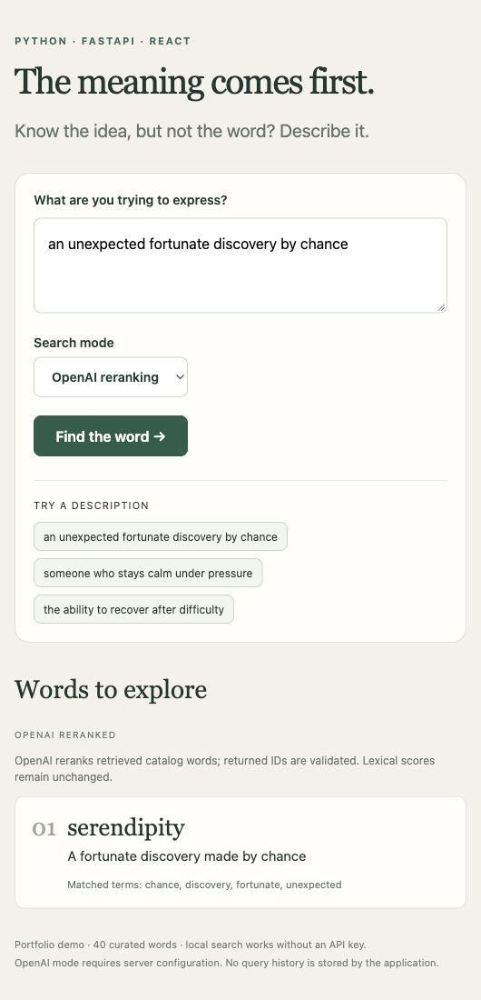

# Verification scope

- 24 Python/FastAPI/SQLite tests passed.
- 3 React UI tests passed.
- React production build passed.
- Local mode works without credentials; the OpenAI provider path is mocked in tests.
- Real OpenAI calls, model quality, deployment, large-vocabulary performance, and embedding search are not verified or claimed.

The original source was later recovered from iCloud: a Flask/OpenAI prototype with unfinished Spring scaffolding. This repository is the modern portfolio rebuild with explicitly documented AI assistance.

Final browser checks verified description-to-word search, the missing-key error for OpenAI mode, and responsive layouts. Hosted CI passed: https://github.com/Sevyn1/reverse-dictionary-ai/actions/runs/37262488172.

## Provider diagnostics — 5 October 2026

The local server was restarted with a user-supplied credential held in memory, outside source files. A live provider request returned HTTP 401 with error code `invalid_api_key`; successful live reranking was not verified at that point. The application now distinguishes rejected credentials, permissions, insufficient quota and rate limiting without returning provider messages or credential fragments. The backend suite now passes 24 tests.

## Successful replacement-key smoke check — 5 October 2026

A replacement credential was accepted by OpenAI and installed in the loopback server’s process environment. No credential was saved to source files or GitHub. Live `gpt-4o-mini` reranking returned HTTP 200 for each public sample:

| Description | First suggestion |
| --- | --- |
| an unexpected fortunate discovery by chance | serendipity |
| someone who stays calm under pressure | equanimity |
| the ability to recover after difficulty | resilience |

The first search was verified through the React browser interface; the other two were verified through the running server API. All three used OpenAI mode. This is a small smoke check, not an independent evaluation of accuracy. The lexical catalog and retrieval limits still apply.

## General AI search and automatic fallback

The “sister of my mother” browser test exposed the original catalog boundary: it returned no match without making a model request. AI mode was revised to generate word/definition suggestions directly and is now the interface default. Provider failures trigger a clearly labeled local fallback. The backend suite passes 36 tests and the frontend suite passes six tests; the UI build passes. The out-of-catalog `aunt` regression and fallback behavior are verified with mocked-provider tests. Live browser verification of this revision is pending because preview access was declined.
